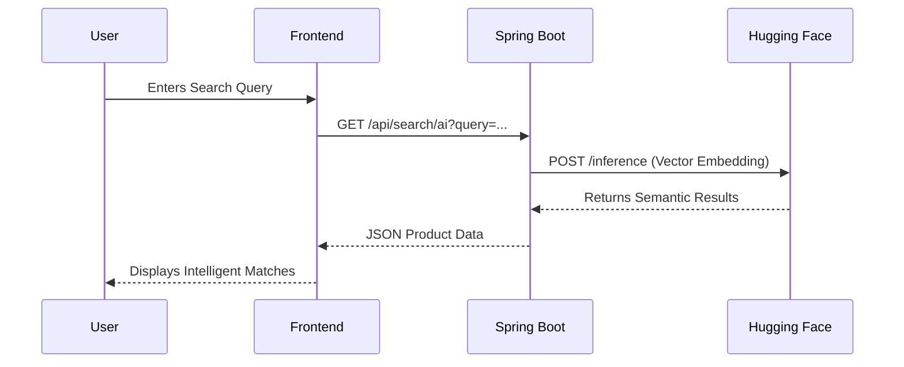

# Luxzera | AI-Powered E-Commerce Platform

Luxzera is a high-performance, intelligent e-commerce ecosystem designed to elevate the online shopping experience. By integrating advanced Natural Language Processing (NLP) with a scalable micro-services architecture, Luxzera moves beyond traditional keyword-based retrieval to provide context-aware product discovery.

## 🏛 System Architecture

The following sequence illustrates the high-performance data flow between the user and our AI engine.



## 📂 Project Structure

A modular, service-oriented design ensures maintainability and clear separation of concerns.

```text
server/src/main/java/com/luxzera/server/
├── auth/          # JWT, Security Filters, Authentication
├── config/        # WebClient, SecurityConfig, Bean Definitions
├── products/      # Core Product Management
│   ├── search/    # Dedicated AI-Powered Discovery Module
│   │   ├── controller/
│   │   └── service/
│   └── controller/# Standard CRUD Operations
└── user/          # User Profiles & Data Management

```

## 🛠 Technical Stack

* **Frontend:** React.js, Tailwind CSS (Minimalist/Futuristic UI)
* **Backend:** Java 17, Spring Boot 3.3.2, JPA/Hibernate
* **AI Engine:** Hugging Face API (BGE-M3 Embeddings)
* **Infrastructure:** PostgreSQL, JWT (Spring Security)
* **Networking:** Spring WebFlux (Non-blocking I/O)

## 🚀 Engineering Highlights

* **Semantic Discovery:** Implemented a decoupled search service that interprets natural language queries, transforming user intent into actionable semantic search vectors.
* **Security & Auth:** Architected a secure authentication flow using Spring Security and JWT, ensuring data integrity and authenticated API access.
* **Modularity:** Adhered to strict MVC patterns, isolating the AI integration layer to ensure the core product management system remains performant and maintainable.
* **Efficient Communication:** Leveraged Spring WebClient for efficient, non-blocking asynchronous communication with external AI providers.

## ⚖️ License & Copyright

© 2026 Saketh Chokkapu. All rights reserved.

The content, architecture, and design of this project are the intellectual property of Saketh Chokkapu. Unauthorized reproduction, distribution, or use of this source code and project documentation is prohibited.

---


add 
