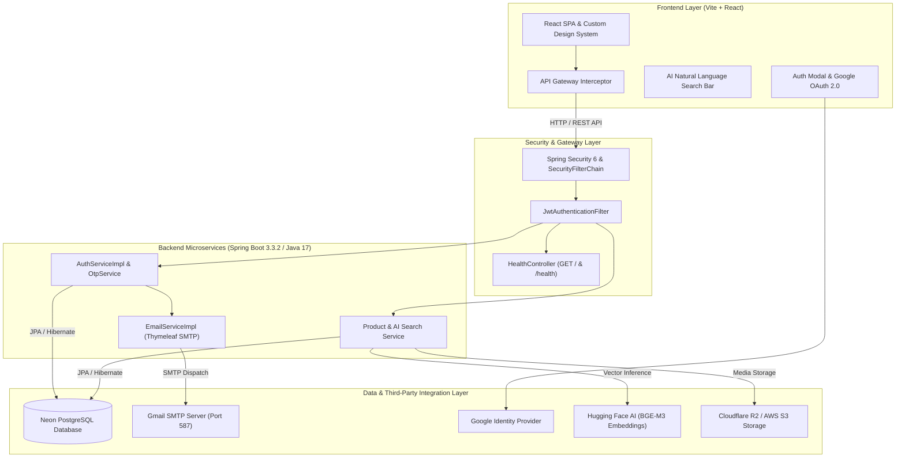
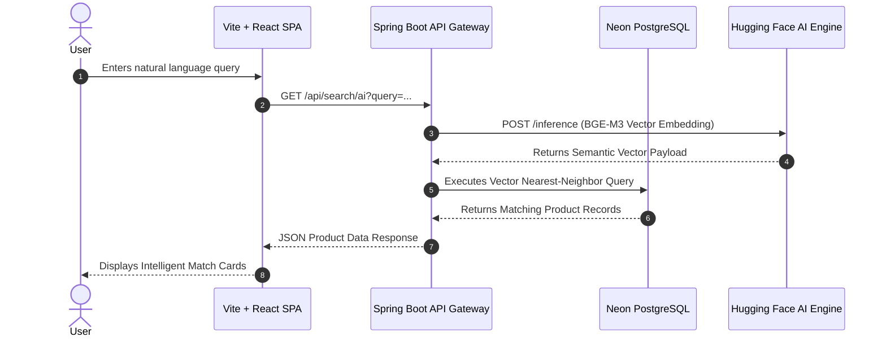

# LuxZera | Modern AI-Powered Luxury E-Commerce Ecosystem

LuxZera is a high-performance, intelligent luxury e-commerce platform built with Spring Boot 3.3.2 and React. Integrating natural language vector embeddings with a decoupled micro-architecture, LuxZera delivers context-aware semantic product discovery and production-grade security.

---

## 🏛 System Architecture

The LuxZera architecture decouples presentation, security filtering, domain microservices, and external integrations (Database, AI Inference, and SMTP Email dispatch).

### Component Flowchart



### AI Search Sequence Diagram



---

## 📂 Project Structure

```text
LUXZERA/
├── frontend/                     # React + Vite Frontend Application
│   ├── src/
│   │   ├── app/                  # Application Root & Mounting
│   │   ├── infrastructure/       # API Gateway & Axios Configuration
│   │   ├── modules/
│   │   │   ├── auth/             # Auth Modal, OTP, Google OAuth & Pages
│   │   │   ├── products/         # Product Catalog & AI Search
│   │   │   └── profile/          # User Settings & Profile Views
│   │   └── shared/               # UI Components, Token & Error Utils
│   └── public/                   # Static Assets & Logos
│
└── server/                       # Spring Boot 3.3.2 Backend Service
    └── src/main/java/com/luxzera/server/
        ├── admin/                # Admin Management & Onboarding
        ├── auth/                 # JWT Auth, SecurityConfig & OTP Service
        ├── common/               # Health Checks & Shared Utilities
        ├── email/                # EmailServiceImpl & Thymeleaf Templates
        ├── products/             # Product Management & AI Search Service
        └── user/                 # User Profile & Data Access Layer
```

---

## 🛠 Technical Stack

| Layer | Technologies |
| :--- | :--- |
| **Frontend** | React.js, Vite, Tailwind CSS, Lucide Icons, Google GSI |
| **Backend** | Java 17, Spring Boot 3.3.2, Spring Security, Spring WebFlux |
| **Database & ORM** | Neon PostgreSQL, JPA / Hibernate |
| **AI Inference** | Hugging Face API (`BGE-M3` Vector Model) |
| **Email & Delivery**| JavaMailSender, Thymeleaf Templates, Gmail SMTP |
| **Storage & Storage**| Cloudflare R2 / AWS S3 SDK |

---

## ⚖️ License & Copyright

© 2026 Saketh Chokkapu. All rights reserved.

The content, architecture, and design of this project are the intellectual property of Saketh Chokkapu. Unauthorized reproduction or distribution is strictly prohibited.
