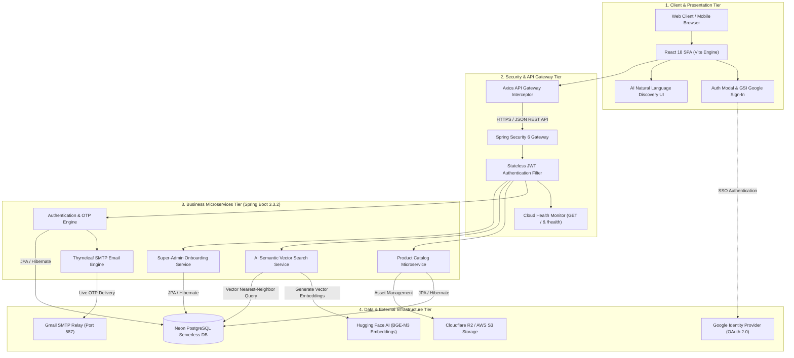
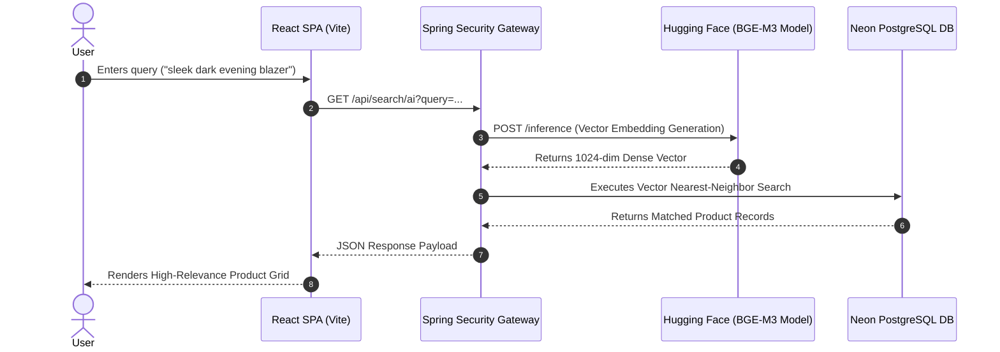

# LuxZera | High-Performance AI Luxury E-Commerce Platform

LuxZera is a high-performance, intelligent luxury e-commerce ecosystem built with Spring Boot 3.3.2 and React. Featuring a 4-tier architecture, LuxZera combines natural language vector embeddings with decoupled microservices, automated email dispatch, and enterprise security.

---

## 🏛 High-Level System Architecture (HLD)

The LuxZera system architecture follows a clean 4-tier design separating Presentation, Gateway Security, Business Microservices, and Data & External Infrastructure.

### High-Level Architecture Diagram



---

## 🔄 End-to-End AI Search Sequence



---

## 📂 Project Structure

```text
LUXZERA/
├── frontend/                     # React + Vite Frontend Application
│   ├── src/
│   │   ├── app/                  # Root Mounting & Router Config
│   │   ├── infrastructure/       # API Gateway & Axios Interceptors
│   │   ├── modules/
│   │   │   ├── auth/             # Auth Modal, OTP & OAuth Views
│   │   │   ├── products/         # Product Catalog & AI Search UI
│   │   │   └── profile/          # User Dashboard & Account Views
│   │   └── shared/               # UI Components, Token & Error Utils
│   └── public/                   # Public Static Assets & Logos
│
└── server/                       # Spring Boot 3.3.2 Backend Service
    └── src/main/java/com/luxzera/server/
        ├── admin/                # Super-Admin Onboarding Service
        ├── auth/                 # JWT Auth, SecurityConfig & OTP Engine
        ├── common/               # Health Probes & Shared Controllers
        ├── email/                # EmailServiceImpl & Thymeleaf Mail Engine
        ├── products/             # Product Management & AI Vector Search
        └── user/                 # User Profile & Data Access Layer
```

---

## 🛠 Technical Stack Overview

| Layer | Technology | Function |
| :--- | :--- | :--- |
| **Frontend** | React 18, Vite, Tailwind CSS, Lucide Icons | Single Page Application & Modern UI |
| **API & Gateway** | Spring Security 6, JWT, Axios Interceptors | Security Filtering & CORS Management |
| **Backend Core** | Java 17, Spring Boot 3.3.2, Spring WebFlux | Microservices Business Logic |
| **Database** | Neon PostgreSQL, JPA / Hibernate | Serverless Relational Storage |
| **AI Vector Engine** | Hugging Face Inference API (`BGE-M3`) | Natural Language Semantic Discovery |
| **Email Service** | JavaMailSender, Thymeleaf, Gmail SMTP | Live OTP & Password Reset Dispatch |
| **Media Storage** | Cloudflare R2 / AWS S3 SDK | Product Image & Asset Hosting |

---

## ⚖️ License & Copyright

© 2026 Saketh Chokkapu. All rights reserved.

The content, architecture, and design of this project are the intellectual property of Saketh Chokkapu. Unauthorized reproduction or distribution is strictly prohibited.
